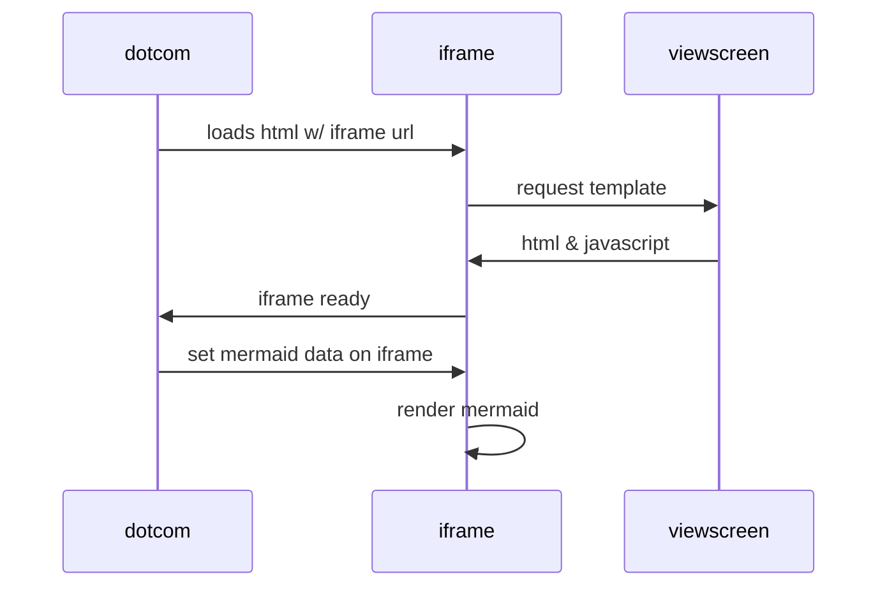

<!-- {:width: "1000px"} -->

The Context
-----------

It has been exactly a decade since the inception of Portswigger's Burp Suite and as a part of their product roadmap they developed and have begun advocating their latest Burp Scanner and one of it's upcoming features being BChecks. This was brought to light in March 2023 in their [Portswigginar](https://youtu.be/mDYsmfeSxd8?t=2240 "YouTube link to PortSwigginar").

In short, BChecks is an extension to the default scan checks in Burp Suite for Burp Scanner. This allows its Professional users to write and use custom scan definitions which can be both public and private. The best part is that, the public scan definitions can be contributed to their [public repo](https://github.com/PortSwigger/BChecks "Link to BChecks' GitHub Repo") on GitHub.

By now you might have understood what you are going to read for the rest of this blog. It will all be about how you can get started and the BChecks workflow/pipeline. Also, this will be technically and unintentionally the first ever blog on BChecks, as we started writing it since Jun 24, 2023, yet were late to make it public.

> Note: If you're a user of Burp Suite Community edition, it's an upset moment for you. Nonetheless, you can also add value to the community by becoming a contributor to the project. And, we hope this blog makes you one!

Getting Started
---------------

To get started with the development of BChecks, you must have Burp Suite Professional (Early Adopter) v2023.6.1, at the time of this writing, the feature was only available via Early Adopter updates. You can easily download, the Early Adopter releases from the official site. The page [Becoming an Early Adopter](https://portswigger.net/burp/documentation/desktop/early-adopter "Link to Portswigger Help") will walk you through the attempt.

**Update:** On the day of publishing this article, BChecks was rolled out to the stable versions v2023.6.2. You can follow the download and setup instructions from [here](https://portswigger.net/burp/releases/professional-community-2023-6-2?requestededition=professional&requestedplatform= "Link to Burp Suite releases").

<figure>
     
    <figcaption style="text-align: center">Fig 1: BChecks User Interface</figcaption>
</figure>

Once installed, spin up Burp Suite Pro and headover to the extensions tab. You will see a new addition called, BChecks just next to the BApp Store sub-tab. The new tab comes with an explorer, a previewer, an editor and a validator for BChecks. In the left pane, there is the explorer and to the right pane there is a previewer. From the explorer, you can either create a new BCheck file or import an exisiting file. All BCheck files end with an extension '.bcheck'.

Alright, the right pane is a preview window, where you can see the contents of a Bcheck file, and to edit an exisiting file, you simply can click on the Edit button.
As you click the button, a new window is opened allowing you to edit existing code.

<figure>
     
    <figcaption style="text-align: center">Fig 2: BChecks (BS) Code Editor Interface</figcaption>
</figure>

The Workflow
------------

We will start by taking a look at the development workflow

<figure>
     
    <figcaption style="text-align: center">Fig 3: Graph for BChecks workflow</figcaption>
</figure>

Conclusion
----------

We at 254 Labs, would keep using BChecks as it makes it trivial to perform custom authenticated scans with no tedious efforts to be made along the path.
The feature indeed is in its way to bloom. But, we are excited to know and see what more we can achieve with this feature in the future to ease our flow of work.

Please note that few of the things that we have discussed here might change in the near future. So, keep watching the official docs and their videos on YT.

If you are aware of similar tools that serve the same purpose, well, you can continue using the same from your arsenal. As long as you know your tool best, the more you can achieve with it. And we don't suggest switching to BChecks until you desperately need it in action. However, if you have a use case where things can only be possible with BChecks or BChecks can improve pen testers experience. Kindly share it with the community.

Cheers!

